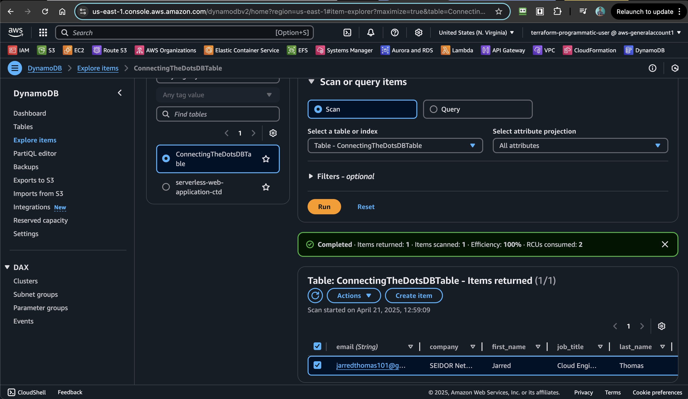

# Phase 1: Flask Localhost Prototype

A local Flask application demonstrating fundamental web development patterns and AWS service integration. This implementation established the foundational architecture for form processing and DynamoDB persistence, serving as the technical proof-of-concept for subsequent serverless iterations.

## Table of Contents

- [Overview](#overview)
- [Real-World Business Value](#real-world-business-value)
- [Prerequisites](#prerequisites)
- [Project Folder Structure](#project-folder-structure)
- [Tasks and Implementation Steps](#tasks-and-implementation-steps)
- [Core Implementation Breakdown](#core-implementation-breakdown)
- [Local Testing and Debugging](#local-testing-and-debugging)
- [Design Decisions and Highlights](#design-decisions-and-highlights)
- [Errors Encountered and Resolved](#errors-encountered-and-resolved)
- [Skills Demonstrated](#skills-demonstrated)
- [Conclusion](#conclusion)

## Overview

This implementation demonstrates a traditional web application architecture using Flask for HTTP request handling and AWS DynamoDB for data persistence. The application provides a contact form interface with backend processing capabilities, establishing the core business logic that would later be adapted for serverless deployment.

The architecture validates three critical components:

1. **Frontend Interface**: HTML forms with proper field validation and user experience
2. **Backend Processing**: Flask route handling with CORS configuration for API compatibility
3. **Data Persistence**: DynamoDB integration using boto3 SDK for scalable storage

This phase identified architectural constraints that informed the migration strategy toward serverless infrastructure in subsequent implementations.

## Real-World Business Value

This prototype delivered foundational business capabilities:

- **Functional Validation**: Confirmed end-to-end workflow from user input to data storage
- **Technology Assessment**: Evaluated Flask framework suitability for form processing requirements
- **AWS Integration**: Established DynamoDB connectivity patterns for customer data management
- **Development Velocity**: Rapid prototyping enabled quick iteration on user interface design
- **Architecture Foundation**: Created reusable business logic for serverless migration

The implementation provided immediate value for local development and testing while revealing scalability limitations that drove architectural evolution.

## Prerequisites

- Python 3.8+
- AWS CLI configured with DynamoDB access permissions
- Virtual environment management (venv or virtualenv)
- AWS DynamoDB table: `ConnectingTheDotsDBTable` (Phase 1 prototype table name)
- Basic understanding of Flask framework and HTTP methods

## Project Folder Structure

```
first-attempt-flask-web-app/
├── backend/                              # Flask application and utilities
│   ├── app.py                            # Main Flask application with CORS support
│   ├── requirements.txt                  # Python dependencies
│   ├── scan_dynamodb.py                  # DynamoDB data retrieval utility
│   ├── pre-signup.py                     # User authentication logic
│   └── *.zip                             # Lambda deployment packages
├── frontend/                             # Static HTML templates and assets
│   ├── index.html                        # Main landing page with API health checks
│   ├── contact.html                      # Contact form with comprehensive fields
│   ├── dashboard.html                    # User dashboard interface
│   ├── base.html                         # Template inheritance base
│   ├── error.html                        # Error handling page
│   └── style.css                         # Responsive styling
└── terraform/                            # Infrastructure as code (future migration)
    ├── main.tf                           # Terraform configuration
    ├── variables.tf                      # Environment variables
    └── outputs.tf                        # Resource outputs
```

## Tasks and Implementation Steps

### Phase 1: Development Environment Setup

1. **Virtual Environment Configuration**: Isolated Python environment with dependency management
2. **Flask Application Structure**: Modular application design with separation of concerns
3. **AWS SDK Integration**: Boto3 configuration for DynamoDB connectivity
4. **Frontend Development**: Responsive HTML forms with proper validation

### Phase 2: Core Functionality Implementation

1. **Route Handler Development**: Flask endpoints with HTTP method handling
2. **CORS Configuration**: Cross-origin request support for API compatibility
3. **Form Processing Logic**: Data validation and sanitisation procedures
4. **Database Integration**: DynamoDB item creation and error handling

### Phase 3: Testing and Validation

1. **Local Server Testing**: Manual form submission validation
2. **Database Verification**: DynamoDB console confirmation of data persistence
3. **API Health Monitoring**: Endpoint availability checking
4. **Error Handling Validation**: Exception management and user feedback

## Core Implementation Breakdown

### Flask Application Architecture

The production Flask application (`app.py`) implements professional development patterns:

```python
from flask import Flask, jsonify, make_response
import boto3

app = Flask(__name__)

# Health check with CORS headers for API compatibility
@app.route("/ping")
def ping():
    response = make_response(jsonify({"status": "alive"}))
    response.headers['Access-Control-Allow-Origin'] = '*'
    response.headers['Access-Control-Allow-Methods'] = 'GET, POST, OPTIONS'
    response.headers['Access-Control-Allow-Headers'] = 'Content-Type'
    return response

# Contact form submission handler (commented for static site transition)
# @app.route("/submit_contact", methods=["POST"])
# def submit_contact():
#     try:
#         # Extract form data with validation
#         first_name = request.form.get("first_name")
#         last_name = request.form.get("last_name")
#         email = request.form.get("email")
#
#         if not first_name or not last_name or not email:
#             return jsonify({"error": "Required fields are missing"}), 400
#
#         # DynamoDB integration
#         dynamodb = boto3.resource("dynamodb")
#         table = dynamodb.Table("ConnectingTheDotsDBTable")
#
#         table.put_item(Item={
#             "email": email,
#             "first_name": first_name,
#             "last_name": last_name,
#             "job_title": request.form.get("job_title"),
#             "phone_number": request.form.get("phone_number"),
#             "company": request.form.get("company")
#         })
#
#         return redirect("/contact")
#     except Exception as e:
#         return jsonify({"error": str(e)}), 500

if __name__ == "__main__":
    app.run(debug=True)
```

### Frontend Implementation

The contact form demonstrates comprehensive field validation and user experience design:

```html
<form action="http://localhost:5000/submit_contact" method="POST">
  <div class="form-row">
    <div class="form-group">
      <label for="first-name">First Name*:</label>
      <input type="text" id="first-name" name="first_name" required />
    </div>
    <div class="form-group">
      <label for="last-name">Last Name*:</label>
      <input type="text" id="last-name" name="last_name" required />
    </div>
  </div>

  <div class="form-row">
    <div class="form-group">
      <label for="email">Email Address*:</label>
      <input type="email" id="email" name="email" required />
    </div>
    <div class="form-group">
      <label for="job-title">Job Title*:</label>
      <input type="text" id="job-title" name="job_title" required />
    </div>
  </div>

  <div class="form-row buttons">
    <input type="submit" value="Send" />
    <input type="reset" value="Reset" />
  </div>
</form>
```

### API Health Monitoring

The Flask application provides a health check endpoint for development testing:

```javascript
// Local development health check
async function checkAPIHealth() {
  try {
    const response = await fetch("http://localhost:5000/ping");
    const data = await response.json();
    document.getElementById(
      "api-health"
    ).innerText = `API Health: ${data.status}`;
  } catch (error) {
    document.getElementById("api-health").innerText = "API Health: Unavailable";
  }
}
```

## Local Testing and Debugging

### Development Server Configuration

Local testing utilised Flask's development server with debug mode enabled:

```bash
# Virtual environment setup
python3 -m venv venv
source venv/bin/activate

# Dependency installation
pip install Flask==2.0.1 Boto3>=1.18.0 Mangum==0.9.0

# Application startup
python backend/app.py
# * Running on http://127.0.0.1:5000/ (Press CTRL+C to quit)
# * Debug mode: on
```

### API Endpoint Validation

Comprehensive testing using manual form submissions and health checks:

```bash
# Test health endpoint
curl http://localhost:5000/ping
# Expected response: {"status": "alive"}

# Validate CORS headers for cross-origin requests
curl -H "Origin: http://localhost:3000" \
     -H "Access-Control-Request-Method: POST" \
     -H "Access-Control-Request-Headers: Content-Type" \
     -X OPTIONS http://localhost:5000/ping
# Expected: CORS headers in response
```

### DynamoDB Integration Testing

Validated data persistence using AWS CLI and console verification:

```bash
# Verify table structure
aws dynamodb describe-table --table-name ConnectingTheDotsDBTable

# Query submitted form data
aws dynamodb scan --table-name ConnectingTheDotsDBTable --region us-east-1

# Check specific item by email
aws dynamodb get-item --table-name ConnectingTheDotsDBTable \
  --key '{"email":{"S":"john.doe@example.com"}}'
```

### Frontend Functionality Verification

Browser-based testing confirmed form submission workflow and error handling:





## Design Decisions and Highlights

### Architecture Pattern Selection

**Traditional MVC over Single-Page Application:**

- **Decision**: Implement server-side rendering with Flask templates
- **Rationale**: Rapid prototyping requirements and familiar development patterns
- **Trade-off**: Limited client-side interactivity but faster initial development

**DynamoDB over Relational Database:**

- **Decision**: NoSQL database for contact form storage
- **Rationale**: Simplified schema management and AWS service integration
- **Benefit**: Serverless-compatible data layer for future migration

**CORS Implementation Strategy:**

- **Decision**: Explicit CORS headers in Flask responses
- **Rationale**: Prepare for API-driven architecture in subsequent phases
- **Implementation**: Manual header configuration for cross-origin compatibility

### Development Practices

**Virtual Environment Isolation:**

- Dependency management with requirements.txt versioning
- Flask 2.0.1 with boto3 >= 1.18.0 for AWS SDK compatibility
- Mangum integration for future Lambda deployment preparation

**Error Handling Strategy:**

- Try-catch blocks for DynamoDB operations
- JSON error responses with appropriate HTTP status codes
- Form validation with required field enforcement

## Errors Encountered and Resolved

### AWS Credential Configuration Issues

**Problem**: DynamoDB connection failures during local development
**Root Cause**: Missing AWS region configuration and credential setup
**Resolution**: Implemented explicit region specification and AWS CLI profile configuration
**Learning**: Local development requires proper AWS credential management even for prototype phases

### CORS Preflight Request Handling

**Problem**: Browser blocking form submissions due to CORS policy violations
**Root Cause**: Missing OPTIONS method handling and proper CORS headers
**Resolution**: Added comprehensive CORS header configuration to all responses
**Impact**: Enabled frontend-backend communication for API testing

### Form Data Processing Inconsistencies

**Problem**: Inconsistent form field extraction and validation
**Root Cause**: Missing null checks and improper error handling
**Resolution**: Implemented comprehensive form validation with required field checking
**Prevention**: Added structured error responses for client-side handling

## Skills Demonstrated

### Web Development Fundamentals

- **Flask Framework**: Route handling, template rendering, and HTTP method processing
- **HTML/CSS**: Responsive form design with proper semantic markup
- **JavaScript**: Asynchronous API communication and DOM manipulation
- **HTTP Protocol**: Understanding of request/response cycles and status codes

### AWS Cloud Integration

- **DynamoDB**: NoSQL database operations using boto3 SDK
- **IAM**: AWS credential management and service permissions
- **SDK Usage**: Python boto3 resource and client patterns

### Development Best Practices

- **Virtual Environments**: Dependency isolation and version management
- **Error Handling**: Exception management and user feedback
- **Code Organization**: Modular application structure with separation of concerns
- **Testing Strategy**: Manual validation and console verification procedures

### Problem-Solving and Architecture

- **Constraint Identification**: Recognition of localhost limitations for production deployment
- **Migration Planning**: Architectural decisions that facilitate serverless transition
- **Documentation**: Comprehensive recording of implementation decisions and challenges

## Conclusion

This implementation successfully validated the core business logic and established foundational patterns for form processing and data persistence. The Flask prototype demonstrated essential web development capabilities while revealing architectural constraints that informed the migration strategy toward serverless infrastructure.

The comprehensive form handling, CORS configuration, and DynamoDB integration provided reusable components for subsequent phases. Most importantly, the limitations identified during local development - including scalability constraints, deployment complexity, and availability requirements - drove the architectural evolution toward API Gateway and Lambda functions.

The systematic documentation of challenges and solutions established a knowledge base that accelerated development in later phases, demonstrating the value of thorough prototyping in complex system design.

**Key Repository Links:**

- [Flask Application Code](first-attempt-flask-web-app/backend/)
- [Frontend Templates](first-attempt-flask-web-app/frontend/)
- [Phase 2 Implementation](second-attempt-s3-web-app/)
- [Detailed Technical Challenges](challenges-and-learnings.md)
