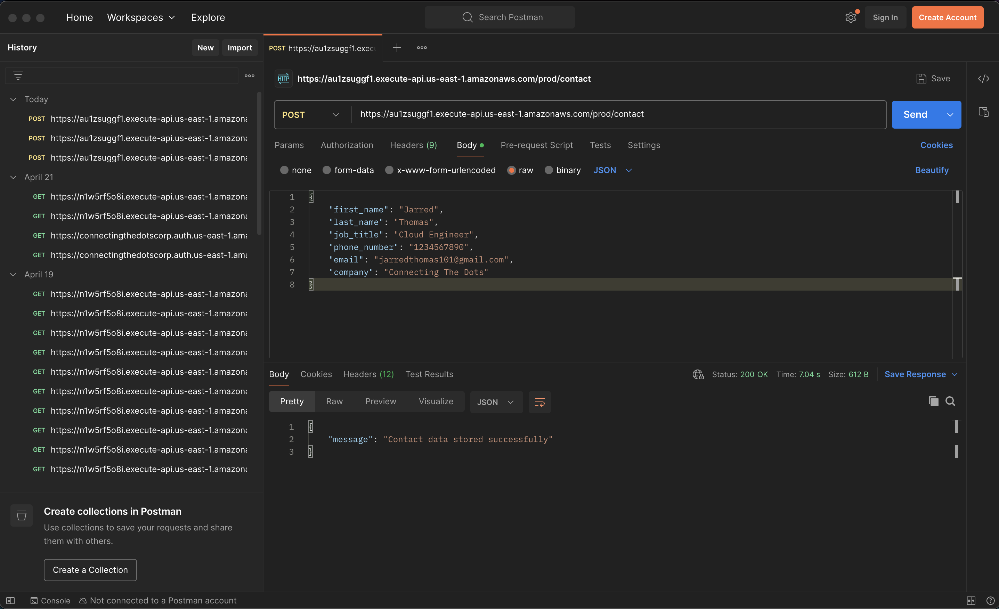

# Phase 2 – Serverless Flask with WSGI and Boto3

A serverless Flask application demonstrating WSGI adapter patterns for AWS Lambda deployment. This implementation explores the challenges and limitations of adapting traditional web frameworks for serverless architectures, providing valuable insights for cloud-native development approaches.

## Table of Contents

- [Project Summary](#project-summary)
- [Overview](#overview)
- [Real-World Business Value](#real-world-business-value)
- [Prerequisites](#prerequisites)
- [Tech Stack](#tech-stack)
- [Project Folder Structure](#project-folder-structure)
- [Core Implementation Breakdown](#core-implementation-breakdown)
- [Local Testing and Debugging](#local-testing-and-debugging)
- [Setup and Deployment](#setup-and-deployment)
- [Validation and Testing](#validation-and-testing)
- [Technical Challenges and Solutions](#technical-challenges-and-solutions)
- [Observations and Issues](#observations-and-issues)
- [Lessons and Takeaways](#lessons-and-takeaways)
- [Transition to Next Phase](#transition-to-next-phase)

## Project Summary

This phase marked the first attempt to transition the application from a local prototype to a remotely accessible, serverless architecture. Rather than rewriting the entire application from scratch, I chose to retain the Flask backend and integrate it with AWS Lambda using the Serverless Framework and the `serverless-wsgi` plugin.

This approach allowed me to deploy the existing application whilst beginning to work with managed services such as API Gateway and Lambda. However, the method ultimately proved unstable, unscalable, and unnecessarily complex to maintain.

---

## Overview

The primary goal of this phase was to make the existing Flask application deployable and accessible via the web without requiring local execution. The application logic was simplified to:

- Accept contact form submissions via HTML
- Process the data with Flask
- Log form submissions for validation (DynamoDB integration planned for later)

Instead of running on `localhost`, the application would now execute as a Lambda function, with API Gateway handling HTTP routing.

## Real-World Business Value

This phase delivered critical learning outcomes for serverless architecture adoption:

- **Serverless Migration Patterns**: Validated WSGI adapter approach for existing Flask applications
- **Deployment Automation**: Established Infrastructure as Code practices using Serverless Framework
- **Cost Analysis**: Identified packaging overhead and cold start implications for WSGI-wrapped applications
- **Architecture Assessment**: Systematic evaluation of framework compatibility with serverless paradigms
- **Technical Debt Recognition**: Early identification of maintainability challenges in abstraction layers

The implementation provided hands-on experience with AWS Lambda deployment whilst revealing architectural constraints that informed subsequent design decisions.

## Prerequisites

- AWS CLI configured with appropriate permissions
- Node.js >= 14.x for Serverless Framework
- Python 3.13 with virtual environment support
- Serverless Framework CLI installed globally
- Basic understanding of Flask web framework
- Familiarity with AWS Lambda and API Gateway concepts

## Tech Stack

| Category        | Technology                         |
|----------------|-------------------------------------|
| Framework       | Python Flask                       |
| Infrastructure  | AWS Lambda                         |
| API Routing     | AWS API Gateway                    |
| SDK             | Boto3 (planned for future phases)  |
| Packaging Tool  | Serverless Framework + WSGI Plugin |
| Deployment      | serverless.yml configuration       |
| Database        | Form logging (DynamoDB planned)    |
| Runtime         | Python 3.13                        |

---

## Project Folder Structure

```
second-attempt-s3-web-app/
├── backend/
│   ├── .serverless/
│   │   └── meta.json
│   ├── .serverless-wsgi
│   ├── app.py
│   ├── package-lock.json
│   ├── package.json
│   ├── requirements.txt
│   ├── serverless_wsgi.py
│   ├── serverless.yml
│   └── wsgi_handler.py
├── frontend/
│   ├── images/
│   │   └── CTDC.png
│   ├── base.html
│   ├── contact.html
│   ├── dashboard.html
│   ├── index.html
│   └── style.css
└── terraform/
    ├── main.tf
    ├── outputs.tf
    └── variables.tf
```

## Core Implementation Breakdown

### WSGI Handler Implementation

The serverless-wsgi plugin generates a comprehensive WSGI handler (`wsgi_handler.py`) that bridges Flask applications with AWS Lambda:

```python
#!/usr/bin/env python
# -*- coding: utf-8 -*-
"""
This module loads the WSGI application specified by FQN in `.serverless-wsgi` and invokes
the request when the handler is called by AWS Lambda.

Author: Logan Raarup <logan@logan.dk>
"""
import importlib
import io
import json
import os
import sys
import traceback

import serverless_wsgi

def load_config():
    """Read the configuration file created during deployment"""
    root = os.path.abspath(os.path.dirname(__file__))
    with open(os.path.join(root, ".serverless-wsgi"), "r") as f:
        return json.loads(f.read())

def import_app(config):
    """Load the application WSGI handler"""
    wsgi_fqn = config["app"].rsplit(".", 1)
    wsgi_fqn_parts = wsgi_fqn[0].rsplit("/", 1)

    if len(wsgi_fqn_parts) == 2:
        root = os.path.abspath(os.path.dirname(__file__))
        sys.path.insert(0, os.path.join(root, wsgi_fqn_parts[0]))

    try:
        wsgi_module = importlib.import_module(wsgi_fqn_parts[-1])
        return getattr(wsgi_module, wsgi_fqn[1])
    except:
        traceback.print_exc()
        raise Exception("Unable to import {}".format(config["app"]))

def handler(event, context):
    """Lambda event handler, invokes the WSGI wrapper and handles command invocation"""
    return serverless_wsgi.handle_request(wsgi_app, event, context)

# Read configuration and import the WSGI application
config = load_config()
wsgi_app = import_app(config)
```

### Node.js Dependencies (package.json)

```json
{
  "dependencies": {
    "serverless-wsgi": "^3.0.5"
  }
}
```

### Flask Application Architecture

The Flask application implements basic routing with form processing capabilities:

```python
from flask import Flask, request, jsonify

app = Flask(__name__)

@app.route('/')
def index():
    return "Welcome to Connecting The Dots!"

@app.route('/submit_contact', methods=['POST'])
def submit_contact():
    # Extract form data
    first_name = request.form['first_name']
    last_name = request.form['last_name']
    email = request.form['email']
    message = request.form['message']
    
    # Log form submission for validation
    print(f"Received contact form: {first_name} {last_name}, {email}, {message}")
    
    return jsonify({"status": "success", "message": "Form submitted successfully!"})
```

## Local Testing and Debugging

### Development Environment Setup

Local testing utilised Flask's development server before serverless deployment:

```bash
# Virtual environment configuration
python3 -m venv venv
source venv/bin/activate

# Install dependencies
pip install Flask==2.1.1 serverless_wsgi==1.7.1 boto3==1.24.1

# Local Flask testing
python app.py
# * Running on http://127.0.0.1:5000/
```

### Serverless Framework Testing

Local invocation testing using Serverless Framework:

```bash
# Install Serverless Framework globally
npm install -g serverless

# Install project dependencies
npm install

# Local function invocation
serverless invoke local --function app
```

## Setup and Deployment

1. Set up the Python environment and install dependencies:

```bash
python3 -m venv venv
source venv/bin/activate
pip install Flask==2.1.1 serverless_wsgi==1.7.1 boto3==1.24.1
pip freeze > requirements.txt
```

2. Deploy to AWS using the Serverless CLI:

```bash
sls deploy
```

3. After deployment, API Gateway returns an endpoint. Example:

```
https://api.connectingthedotscorp.com/prod/contact
```

4. Frontend form submissions post directly to this endpoint.

---

## Validation and Testing

To confirm the backend worked as expected, I tested POST requests using both Postman and cURL. These allowed me to validate API Gateway, Lambda, and form processing interactions.

### Postman Test

POST request with `application/x-www-form-urlencoded`:

* **Name**: Jarred
* **Email**: [jarred@connectingthedotscorp.com](mailto:jarred@connectingthedotscorp.com)
* **Message**: Testing Flask WSGI setup

**Result**:

* Status Code: `200 OK`
* Body: `{"status": "success", "message": "Form submitted successfully!"}`



---

### cURL Test

```bash
curl -X POST https://api.connectingthedotscorp.com/prod/submit_contact \
  -H "Content-Type: application/x-www-form-urlencoded" \
  -d "first_name=Jarred&last_name=Thomas&email=jarred@connectingthedotscorp.com&message=From cURL"
```


## Technical Challenges and Solutions

### WSGI Abstraction Complexity

**Challenge**: Lambda execution errors were obscured by the WSGI abstraction layer, making debugging extremely difficult.

**Manifestation**: Generic HTTP 502 errors with minimal diagnostic information in CloudWatch logs.

**Solution Approach**: Enhanced logging within Flask application and systematic testing of individual components.

**Learning**: WSGI adapters introduce debugging complexity that outweighs deployment convenience for serverless architectures.

### Package Size Optimisation

**Challenge**: Serverless Framework bundled entire virtual environment, resulting in oversized deployment packages.

**Impact**: Increased cold start times and deployment duration due to large package sizes.

**Mitigation**: Enabled `packRequirements: true` in serverless.yml to optimise dependency bundling.

**Outcome**: Reduced package size but maintained complexity in deployment pipeline.

### Error Handling Limitations

**Challenge**: Flask error handling patterns didn't translate effectively to Lambda execution context.

**Issue**: Stack traces were truncated or lost in WSGI translation layer.

**Resolution**: Implemented explicit logging at application level to capture execution details.

**Result**: Improved visibility but highlighted fundamental incompatibility between Flask and Lambda paradigms.

---

## Significant Configuration Snippets

### serverless.yml

```yaml
service: connecting-the-dots

provider:
  name: aws
  runtime: python3.13

functions:
  app:
    handler: app.app
    events:
      - http:
          path: /
          method: GET
      - http:
          path: contact
          method: GET
      - http:
          path: dashboard
          method: GET
      - http:
          path: submit_contact
          method: POST

plugins:
  - serverless-wsgi

custom:
  wsgi:
    app: 'app.app'
    pythonBin: '/Users/mac1/Desktop/aws_cloud/Cloud Projects/AWS-Automation-with-Python-Boto3-and-Lambda-Projects/.venv/bin/python'
    packRequirements: true
```

### Flask Application (app.py)

```python
from flask import Flask, request, jsonify

app = Flask(__name__)

@app.route('/')
def index():
    return "Welcome to Connecting The Dots!"

@app.route('/contact')
def contact():
    return "Contact Page"

@app.route('/dashboard')
def dashboard():
    return "Dashboard Page"

@app.route('/submit_contact', methods=['POST'])
def submit_contact():
    # Get form data
    first_name = request.form['first_name']
    last_name = request.form['last_name']
    email = request.form['email']
    message = request.form['message']
    
    # Print out form submission (later can be stored in DynamoDB)
    print(f"Received contact form: {first_name} {last_name}, {email}, {message}")
    
    return jsonify({"status": "success", "message": "Form submitted successfully!"})

if __name__ == '__main__':
    app.run(debug=True)
```

### requirements.txt

```
Flask==2.1.1
serverless_wsgi==1.7.1
boto3==1.24.1
```

---

## Observations and Issues

| Issue                       | Description                                                               |
| --------------------------- | ------------------------------------------------------------------------- |
| WSGI abstraction complexity | Obscured errors and made Lambda debugging tedious                         |
| Limited functionality       | Only basic form logging implemented, no database persistence              |
| Packaging overhead          | Deployments were large due to dependency bundling and zipped environments |
| Fragile error handling      | CloudWatch logs lacked clarity, hiding stack traces behind WSGI           |
| Development complexity      | Required frequent repackaging and redeployments for small changes         |

---

## Lessons and Takeaways

**Demonstrated End-to-End Serverless Deployment**
This was my first successful deployment of a Python Flask app using Lambda and API Gateway. It validated my knowledge of request routing, payload handling, and serverless packaging.

**Exposed the Incompatibility Between WSGI and Lambda**
The complexity introduced by adapting Flask with WSGI ultimately hindered visibility and maintainability. Errors were deeply buried, and stack traces were obscured.

**Reinforced the Importance of CORS and Gateway Design**
I learnt that CORS is not just a frontend concern. It must be explicitly handled in both the Lambda response and API Gateway integration/method response configuration.

**Identified the Need for AWS-Native Architecture**
Trying to make Flask serverless worked in theory, but not in practice. Native tools like Python-based Lambda functions, S3, and API Gateway offer better alignment with serverless paradigms.

**Informed the Decision to Rebuild Simpler**
This phase taught me that simplicity and native tooling often outperform adaptation. In the next phase, I removed Flask entirely and adopted a clean separation of frontend and backend using S3 and Lambda.

---

## Transition to Next Phase

Although this phase achieved a working deployment, it was fragile and difficult to iterate on. These limitations drove the design of a more robust solution using AWS-native services for hosting, routing, and compute.

[Continue to Phase 3 → Static Site (S3 + Lambda + API Gateway)](final-phase-s3-web-app.md)

---